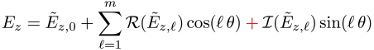

The openPMD Standard
====================

VERSION: **1.0.0** (November 11th, 2015)

Conventions Throughout these Documents
--------------------------------------

The key words "MUST", "MUST NOT", "REQUIRED", "SHALL", "SHALL NOT", "SHOULD",
"SHOULD NOT", "RECOMMENDED",  "MAY", and "OPTIONAL" in this document are to be
interpreted as described in [RFC 2119](http://tools.ietf.org/html/rfc2119).

All `keywords` in this standard are case-sensitive.

The naming *(floatX)* without a closer specification is used if the implementor
can choose which kind of floating point precision shall be used.
The naming *(uintX)* and *(intX)* without a closer specification is used if the
implementor can choose which kind of (un)signed integer type shall be used.
The naming for the type *(string)* refers to fixed-length, plain ASCII encoded
character arrays since they are the only ones that are likely to propagate
through all file-format APIs and third-party programs that use them.

Sometimes brackets `<Name>` are used for keywords while the `<>` only indicate
the keyword is required (but the `<>` itself shall not be written).
Accordingly, optional keywords and options are indicated via square brackets
`[Name]`.


The Versions of this Standard
-----------------------------

Versions of the standard allow codes and implementors to easily differentiate
between new updates that are incorporated.

The full version number is always used in format `<MAJOR>.<MINOR>.<REVISION>` .

Improvements will be sought to be backwards compatible, if that is not
possible then changes in the major version of this standard indicate
incompatibility.
Minor version updates instead need to be backwards compatible and should for
example only add new (ideally optional or recommended) keywords.
Revisions are reserved for typos and clarification in the standard (but not
for changes in keywords).


Hierarchy of the Data File
--------------------------

The used hierarchical data file format must provide the capability to

  - create groups and sub-groups (in-file directories)
  - create multi-dimensional, homogenous array-based data structures

while allowing for each of those to assign

  - multiple, distinct attributes
    (basic and array floating/integer types, strings)
  - with platform-independent representation.

We define the following placeholders and reserved characters:

  - `/`: separator of groups
  - `%T`: an iteration (unsigned integer type,
                        same range as a 64bit unsigned integer).

**Paths** to **groups** end on `/`, e.g., `/mySubGroup/` and **data sets** end
without a `/`, e.g., `dataSet` or `/path/to/dataSet`.

Each file's *root* directory (path `/`) must at leat contain the attributes:

  - `openPMD`
    - type: *(string)*
    - description: (targeted) version of the format in "MAJOR.MINOR.REVISION",
                   see section "The versions of this standard",
                   minor and revision must not be neglected
    - example: `1.0.0`

  - `openPMDextension`
    - type: *(uint32)*
    - description: the bit-mask of unique IDs of applied extensions of the
                   openPMD standard
                   (see: *Domain-Specific Extensions*);
                   to test for a specific extension `ID` perform a bit-wise
                   `AND` operation on `openPMDextension`:
                   `extension_1_used = (( openPMDextension AND ID ) == ID)`
    - note: if only one extension is used at a time, the value for
            `openPMDextension` is simply the `ID` of the extension
    - examples:
      - `0`: only the base standard is used
      - `1`: the base standard and the extension with ID `1` apply for the file
      - general case (discouraged in this version of the standard):
             `openPMDextension=0 OR <ID1> OR <ID2> OR <...>` (bit-wise `OR`)

  - `basePath`
    - type: *(string)*
    - description: a common prefix for all data sets and sub-groups of a
                   specific iteration;
                   this string only indicates *how* the data is stored,
                   to create a real path from it replace all occurrences
                   of `%T` with the integer value of the iteration, e.g.,
                   `/data/%T` becomes `/data/100`
    - allowed value: fixed to `/data/%T/` for this version of the standard
    - note: all the data that is formatted according to the present
      standard (i.e. both the meshes and the particles) is to be
      stored within a path of the form given by `basePath` (e.g. in
      the above example, the data will be stored within the path `/data/100/`).
      If, for various reasons, a user wants to store *additional
      data* that is not (or cannot be) formatted according to the
      present standard (e.g. fields on an unstructured mesh),
      this can be done be storing this data within a path that *is not*
      of the form given by `basePath` (e.g. `/extra_data`). In this
      way, the openPMD parsing tools will not parse this additional data. 

  - `meshesPath`
    - type: *(string)*
    - description: path *relative* from the `basePath` to the mesh records
    - example: `meshes/`

  - `particlesPath`
    - type: *(string)*
    - description: path *relative* from the `basePath` to the groups for each
                   particle species and the records they include
    - example: `particles/`

It is *recommended* that each file's *root* directory (path `/`) further
contains the attributes:

  - `author`
    - type: *(string)*
    - description: Author and contact for the information in the file
    - example: `Axel Huebl <a.huebl@hzdr.de>`

  - `software`
    - type: *(string)*
    - description: the software/code/simulation that created the file
    - example: `PIConGPU`, `Warp`

  - `softwareVersion`
    - type: *(string)*
    - description: the version of the software/code/simulation that created the
                   file
    - example: `1.2.1`, `80c7551`, `rev42`

  - `date`
    - type: *(string)*
    - description: date of creation in format "YYYY-MM-DD HH:mm:ss tz"
    - example: `2015-12-02 17:48:42 +0100`

Each group and data set may contain the attribute **comment** for general
human-readable documentation, e.g., for features not yet covered by the
standard:

  - `comment`
    - type: *(string)*
    - description: an arbitrary comment
    - example: `After each time step we randomly removed 5 particles.`


Iterations and Time Series
--------------------------

Iterations can be encoded in either the file name of each master-file of a
time step or in groups of the same file. (Here, an *iteration* refers
to a single simulation cycle.)

The chosen style shall not vary within a related set of iterations.

Each file's *root* directory (path `/`) must further define the attributes:

  - `iterationEncoding`
    - type: *(string)*
    - description: tells if other iterations of this series, from the
                   file-format's API point of view, encoded in the same file or
                   is an other `open/close` call necessary to access other
                   iterations
    - allowed values:
      - `fileBased` (multiple files)
      - `groupBased` (one file)

  - `iterationFormat`
    - type: *(string)*
    - description: a well defined string with the iteration `%T` placeholder
                   defining either the series of files (`fileBased`) or the
                   series of groups within a single file (`groupBased`)
                   that allows to extract the iteration from it;
                   for `fileBased` formats the iteration must be included
                   in the file name;
                   the format depends on the selected `iterationEncoding` method
    - examples:
      - for `fileBased`:
        - `filename_%T.h5` (without file system directories)
      - for `groupBased`:
        - `/data/%T/` (must be equal to and encoded in the `basePath`)


Required Attributes for the `basePath`
--------------------------------------

In addition to holding information about the iteration, each series of
files  (`fileBased`) or series of groups (`groupBased`) should have
attributes that describe the current time and the last
time step.

 - `time`
   - type: *(floatX)*
   - description: the time corresponding to this iteration. Because at
                  one given iteration, different quantities may be defined
                  at different times (e.g. in a staggered code), this time is
                  defined as a global reference time for this iteration. This
                  ambiguity is then resolved at the *record* level (see below),
                  where each quantity has an attribute `timeOffset` which
                  corresponds to its offset with respect the reference `time`.
   - example: In a staggered PIC code, the `time` attribute can be the time at
              which the electric field is defined, and the magnetic field would
              then have a non-zero `timeOffset`.

 - `dt`
   - type: *(floatX)*
   - description: The latest time step (that was used to reach this iteration).
                  This is needed at the iteration level, since the time step
                  may vary from iteration to iteration in certain codes.

 - `timeUnitSI`
    - type: *(double / REAL8)*
    - description: a conversation factor to convert `time` and `dt` to `seconds`
    - example: `1.0e-16`


Scalar, Vector and Tensor Records
---------------------------------

In general, all data sets shall be stored as homogenous arrays or matrices
respectively, depending on the (spatial) dimensionality of the record they
represent.

Records with only a scalar component are stored in a data set with the same name
as the record. Vector and tensor records shall be represented component-wise as
a *collection of individual scalar data sets* using a common sub-group that is
equal to the record name.

We refer to the scalar record itself and the vector sub-group as `record`, to
the data sets in the vector sub-group as `components`. For scalar records,
the `record` is the `component` (and vice versa).

### Naming conventions

  - names of `records` and `components`
    - type: *(string)*
    - description: names of records and their components are only allowed to
                   contain the characters `a-Z`, the numbers `0-9` and the
                   underscore `_` (the regex `\w`)
    - rationale: this avoids incompatibilities between file formats and
                 allows efficient parsing via regular expressions

  - `scalar` record
    - type: *(any type)*
    - data set: `recordName` unique name in group `basePath` +
                `meshesPath` or alternatively in `basePath` +
                `particlesPath` + `particleName`
    - examples:
      - `/data/meshes/temperature`
      - `/data/particles/electrons/charge`

  - `vector` records
    - type: *(any type)*
    - data sets: `recordName/x`, `recordName/y`, `recordName/z` when
                 writing the *Cartesian* components of the vectors;
                 `recordName/r`, `recordName/t`, `recordName/z` when
                 writing the *cylindrical* components of the vectors.
                 Here `recordName` is a sub-group. The components `x`,
                 `y`, `z` (or respectively `r`, `t`, `z`) are data
                 sets of `scalar` meshes.
    - examples:
      - `/data/meshes/F/`
        - `x`
        - `y`
        - `z`
      - `/data/meshes/F/`
        - `r`
        - `t`
        - `z`
      - `/data/particles/electrons/position/`
        - `x`
        - `y`
        - `z`


Mesh Based Records
------------------

Mesh based records such as discretized fields shall be represented as
homogenous records, usually in a N-dimensional matrix.

### Required Attributes for each `mesh record`

The following attributes must be stored additionally with the `meshName` record
(which is a data set attribute for `scalar` or a group attribute for `vector`
meshes):

  - `geometry`
    - type: *(string)*
    - description: geometry of the mesh of the mesh record, right-handed
                   coordinate systems are imposed
    - allowed values:
      - `cartesian`: standard Cartesian mesh
      - `thetaMode`: regularly-spaced mesh in the r-z plane, with
                     Fourier decomposition in the azimuthal direction (See
                     [doi:10.1016/j.jcp.2008.11.017](http://dx.doi.org/10.1016/j.jcp.2008.11.017))
                     In this case, the mesh arrays are stored as a
                     three-dimensional record where the last axis corresponds
                     to the `z` direction, the second axis correspond to the
                     `r` direction and where the first axis corresponds to
                     the azimuthal mode. (This last axis has length `2m+1`,
                     where `m` is the number of modes used. By convention,
                     this first stores the real part of the mode `0`, then
                     the real part of the mode `1`, then the imaginary part
                     of the mode `1`, then the real part of the mode `2`,
                     etc.)
      - reserved: `cylindrical`, `spherical`
      - `other`

  - `geometryParameters`
    - type: *(string)*
    - description: additional parameters for the geometry, separated by a `;`,
                   this attribute is required when `geometry` is
                   `thetaMode`,  but can be omitted if geometry is `cartesian`
    - examples:
      - for `thetaMode` geometry:
        - `m=3;imag=+` (3 *modes* and using a `+` sign for the definition of
                        the *imaginary* part)
                       

  - `dataOrder`
    - type: *(string)*
    - description: used for the reading of 1-dimensional arrays of N elements,
                   where N is the number of dimensions in the simulation;
                   these should be in the ordering of variation for the indexes
                   for matrices as defined by the index-operator (`[...][...]`)
                   of the writing code; can be omitted for 1D records
    - rationale: in Fortran, ordering of matrices is linearized in memory in
                 column-major order whereas in C it is row-major; due to that
                 the index-operators in Fortran and C operate in exactly
                 opposite order;
                 supported file-formats keep the order of the writing code's
                 record components; we still need to store additional
                 information such as `axisLabels` in a defined order
    - allowed values:
      - `C` if data is written by C or a C-like language such as C++, Python,
        Java
      - `F` if data is written by a Fortran code

  - `axisLabels`
    - type: 1-dimensional array containing N *(string)*
            elements, where N is the number of dimensions in the simulation
    - description: ordering of the labels for the `geometry` of the mesh
    - advice to implementors: in the ordering of variation for the indexes for
                              matrices as defined by the index-operator
                              (`[...][...]`) of the writing code
    - advice to implementors: on read, query the record's `dataOrder` to get the
                              information if you need to invert the access to
                              `axisLabels` (and other attributes that use the
                              same definition)
    - examples:
      - 3D `cartesian` C-style `A[z,y,x]` write: `("z", "y", "x")` and `dataOrder='C'`
      - 2D `cartesian` C-style `A[y,x]` write: `("y", "x")` and `dataOrder='C'`
      - 2D `cartesian` Fortran-style `A[x,y]` write: `("x", "y")` and `dataOrder='F'`
      - `thetaMode` Fortran-style `A[r,z]` write: `("r", "z")` and `dataOrder='F'`

  - `gridSpacing`
    - type: 1-dimensional array containing N *(floatX)*
            elements, where N is the number of dimensions in the simulation
    - description: spacing of the grid points along each dimension (in the
                   units of the simulation); this refers to the spacing of the
                   actual record that is written to the file, not that of the
                   simulation grid. (The record written may be down-sampled, as
                   compared to the simulation grid).
    - advice to implementors: the order of the N values must be identical to
                              the axes in `axisLabels`

  - `gridGlobalOffset`
    - type: 1-dimensional array containing N *(double / REAL8)*
            elements, where N is the number of dimensions in the simulation
    - description: start of the current domain of the simulation (position of
                   the beginning of the first cell) in simulation units
    - advice to implementors: the order of the N values must be identical to
                              the axes in `axisLabels`

    - example: `(0.0, 100.0, 0.0)` or `(0.5, 0.5, 0.5)`

  - `gridUnitSI`
    - type: *(double / REAL8)*
    - description: unit-conversion factor to multiply each value in
                   `gridSpacing` and `gridGlobalOffset`, in order to convert
                   from simulation units to SI units
    - example: `1.0e-9`

The following attributes must be stored with each `scalar record` and each
*component* of a `vector record`:

  - `position`
    - type: 1-dimensional array of N *(floatX)* where N is the number of
            dimensions in the simulation.
    - range of each value: `[ 0.0 : 1.0 )`
    - description: relative position of the component on the current element of
                   the mesh/grid/node/cell/voxel;
                   `0.0` means at the beginning of the mesh element and `1.0` is
                   the beginning of the next mesh element;
                   the same dimensionality N as in `gridSpacing` and
                   `gridGlobalOffset`


Particle Records
----------------

Each `particle species` shall be represented as a group `particleName/` that
contains all its records. Particles records are generally represented in
one-dimensional contiguous records, where the n-th entry in
`particleName/recordNameA` and the n-th entry in `particleName/recordNameB`
belong to the same particle.

### Naming conventions

As with general `vector` records, compound particle vector records
are again split in scalar components that are stored in a common
sub-group `particleName/recordName/`
(see: *Scalar, Vector and Tensor Records*). Also, record components that are
constant for all particles of a species (and iteration) can be replaced with a
short-hand notation (see: *Constant Record Components*).

### Records for each `Particle Species`

  - `id`
    - type: *(uint64 / UNSIGNED8)*
    - scope: *optional*
    - description: a globally-unique identifying integer for each particle,
                   that can be used to, e.g., track particles. This
                   identifying integer should be truly unique within the
                   simulation; in particular, even among different particle
                   species, two particles should not have the same id.
                   Also, when a particle exits the simulation box, its
                   identifying integer should not be reassigned to a new
                   particle.

  - `position/` + components such as `x`, `y`, `z`
    - type: each component in *(floatX)* or *(intX)* or *(uintX)*
    - scope: *required*
    - description: component-wise position of a particle, relative to
                   `positionOffset`
    - example: use only `x` and `y` in 2D, use `x` in 1D

  - `positionOffset/` + components such as `x`, `y`, `z`
    - type: each component in *(floatX)* or *(intX)* or *(uintX)*
    - scope: *required*
    - description: an offset to be added to each element of `position`
    - rationale: for precision reasons and visualization purposes, it is
                 often more useful to define all positions of an iteration
                 relative to an offset; extensions might use this record to
                 define relations to mesh records
    - advice to implementors: to reduce read/write accesses and memory
                              consumption, it is often useful to implement this
                              with `constant record components`
    - example: reading example (with h5py) in Python:
```python
def is_const_component(record_component):
    return ("value" in record_component.attrs.keys())

def get_component(group, component_name):
    record_component = group[component_name]
    unitSI = record_component.attrs["unitSI"]

    if is_const_component(record_component):
        return record_component.attrs["value"], unitSI
    else:
        return record_component.value, unitSI

f = h5py.File('example.h5')
species = f["<path_to_species_group>"]

position_x_relative, unitXRel = get_component(species, "position/x")
position_x_offset, unitXOff = get_component(species, "positionOffset/x")

x = position_x_relative * unitXRel + \
    position_x_offset * unitXOff
```


### Sub-Group for each `Particle Species`

Within each particle species' group the sub-group `particlePatches` alongside
its records, as mentioned above, is *recommended* for parallel
post-processing. The idea is to logically order the 1D arrays of attributes into
local patches of particles that can be read and processed in parallel.

To allow efficient parallel post-processing, checkpointing and visualization
tools to read records with a size of more than the typical size of a
local-node's RAM, the records in this sub-group allow to sub-sort particle
records that are close in the n-dimensional `position` to ensure an
intermediate level of data locality. Patches of particles must be
hyperrectangles regarding the `position` (including `positionOffset`s as
described above) of the particles within. The union of all particle patches
must correspond to the complete particle's records.

For the creation of those particle patches, already existing information in
memory layouts such as linked lists of particles or per-node domain
decompositions can be reused. The most trivial (serial) implementation of a
particle patch would be the description of a single patch spaning the whole
spatial domain of particles.

If the `particlePatches` sub-group exists, the following records within it
are *required* and the entries in each record are stored in a per particle
patch order:

  - `numParticles`
    - type: *(uint64 / UNSIGNED8)*
    - description: number of particles in this patch
    - examples:
      - serial, one patch: the global number of all particles
      - parallel, e.g. MPI: the number of particles of a MPI rank;
                            the sum of all entries in this record is the global
                            number of particles

  - `numParticlesOffset`
    - type: *(uint64 / UNSIGNED8)*
    - description: offset within the one-dimensional records of the particle
                   species where the first particle in this patch is stored
    - examples:
      - serial, one patch: `0`
      - parallel, e.g. MPI: the number of particles of all MPI ranks' patches
                            that were stored before this one

  - `offset/` + components such as `x`, `y`, `z`
    - type: each component in *(floatX)* or *(intX)* or *(uintX)*
    - description: absolute position (`position` + `positionOffset` as defined
                   above) where the particle patch begins:
                   defines the (inclusive) lower bound with positions that are
                   associated with the patch;
                   the same requirements as for regular record components apply

  - `extent/` + components such as `x`, `y`, `z`
    - type: each component in *(floatX)* or *(intX)* or *(uintX)*
    - description: extent of the particle patch; the `offset` + `extent` must
                   be larger than the maximum absolute position of particles in
                   the patch as the exact upper bound of position `offset` +
                   `extent` is excluded from the patch;
                   the same requirements as for regular record components apply


Unit Systems and Dimensionality
-------------------------------

While this standard does not impose any unit system on the data that is stored
itself, it still requires a common interface to convert one unit system to
another.

To allow scaling data without reformatting it during the write process we
provide a unit conversation factor, often called `unitSI` in the document,
to transform it to a corresponding quantity in the International System of
Units (SI).

For each `mesh` or `particle` `record` and their `components` the following
attributes must be added:

### Required for each `Record Component`

Reminder: for scalar records the `record` itself is also the `component`.

  - `unitSI`
    - type: *(double / REAL8*)
    - description: a conversation factor to multiply data with to be
                   represented in SI
    - rationale: can also be used to scale a dimension-less `component`
    - rationale: if the `component` is dimension-less and in the right scaling
                 or already in SI, e.g., an index counter, set this to `1.0`
    - example: `2.99792e8`

### Required for each `Record`

  - `unitDimension`
    - type: array of 7 *(double / REAL8)*
    - description: powers of the 7 base measures characterizing the record's
                   unit in SI (length L, mass M, time T, electric current I,
                   thermodynamic temperature theta, amount of substance N,
                   luminous intensity J)
    - rationale: this allows to implement automated record detection,
                 identification and compatibility checks, independent of
                 specific names or string representations;
                 does *not* represent if the record is a 1, 2 or 3D array
    - rationale: if the `record` is dimension-less, such as an index, set this
                 to `(0., 0., 0., 0., 0., 0., 0.)`
    - advice to implementors: implement a lookup table for the most common
                              quantities/units in your simulation, e.g.,
                              electric field strengths, mass, energy, etc.
                              in the respect of the power of the base units
                              given here
    - examples:
      - "m / s" is of dimension `L=1` and `T=-1`,
        store array `(1., 0., -1., 0., 0., 0., 0.)`
      - "N = kg * m / s^2", store array `(1., 1., -2., 0., 0., 0., 0.)`
      - magnetic field: "T = kg / (A * s^2)", store array
                        `(0., 1., -2., -1., 0., 0., 0.)`
      - electric field: "V/m = kg * m / (A * s^3)", store array
                        `(1., 1., -3., -1., 0., 0., 0.)`

  - `timeOffset`
    - type: *(floatX)*
    - description: the offset between the time at which this record is
                   defined and the `time` attribute of the `basePath` level.
                   This should be written in the same unit system as `time`
                   (see `basePath`; i.e., it should be multiplied by
                   `timeUnitSI` to get the actual time in seconds.)
    - example: In a staggered PIC code, if `time` is chosen to correspond to
               the time at which the electric field is defined, and if `dt`
               is e.g. 1.e-5, `timeOffset` would be 0.5e-5 for the magnetic
               field and 0. for the electric field.

### Advice to Implementors

For the special case of simulations, there can be the situation that a certain
process scales independently of a given fixed reference quantity that
can be expressed in SI, e.g., the growth rate of a plasma instability can
scale over various orders of magnitudes solely with the plasma frequency
and the basic constants such as mass/charge of the simulated particles.

In such a case, picking a *reference density* to determine the `unitSI`
factors is required to provide a fallback for compatibility.

For human readable output, it is *recommended* to add the actual string
of the unit in the corresponding `comment` attribute.


Constant Record Components
--------------------------

For records components that are constant (for a certain iteration), replacing
the record component with a group attribute of the same name is possible, as
described in the following paragraphs. For scalar records, the component is as
usual the record itself.

Replacing a record component with a constant value for all values on the mesh
or for all particles respectively works as follows:
The record's *data set* `<componentName>` must be replaced with an empty
*sub-group* `<componentName>/` that hosts the group-attributes `value` and
`shape`.

`shape` is a 1-dimensional array of `N` *(uint64)* elements, where `N` is the
number of dimensions of the record. It contains the number of elements of each
dimension that are replaced with a constant value. For `mesh` based records,
the order of the `N` values must be identical to the axes in `axisLabels`.

Other required attributes that where previously stored on the *data set* need
to be added to the new sub-group as well.

Examples:
  - the `mesh` record for a magnetic field `B` is constant for `B.x` and `B.y`:
    - `<basePath><meshesPath>B/`: record group with standard attributes, e.g.,
                                  `unitDimension`
      - `x/`: sub-group with attributes `value=<C0>`, `shape=array(..., ...)`
              and standard attributes, e.g., `unitSI`
      - `y/`: sub-group with attributes `value=<C1>`, `shape=array(..., ...)`
              and standard attributes, e.g., `unitSI`
      - `z`: data set with standard attributes, e.g., `unitSI`
  - the `mesh` record for a temperature field `T` is constant
    - `<basePath><meshesPath>T/`: record group with attribute `value=<C0>`,
                                  `shape=array(...)` and standard attributes,
                                  e.g., `unitDimension` and `unitSI`
  - the `particle` record `charge` for the particle species `electrons` is
    constant
    - `<basePath><particlesPath>electrons/charge/`: record group with attribute
                                                    `value=-1.0`,
                                                    `shape=array(...)` and
                                                    standard attributes, e.g.,
                                                    `unitSI=1.60217657e-19` and
                                                    `unitDimension=array(...)`


Domain-Specific Extensions
--------------------------

The base standard defined in this document is sufficient for describing
*general* mesh and particle based records.

For specific domains of engineering and science and to allow code
interoperability, specific conventions are necessary. As an example, some
records may be of distinct importance and should be read/written with exactly
the same name or are always required for, e.g., restarts and checkpoints.

Also additional meta information may be useful for publishing the data
created by a scientific instrument or simulation, e.g., the focal length
of a camera objective or the used algorithms in a specific simulation.
Even if they are not necessary for code-interoperability, an extension
can require additional information to describe the created data further.

The openPMD standard is therefore organized in the *base standard* and
*domain-specific extensions* (with a unique ID). In the current version of
the standard, using multiple extensions at the same time is discouraged.

Up to now, the following domain-specific naming conventions for have been
defined:

- **ED-PIC**: electro-dynamic/static particle-in-cell codes,
  see [EXT_ED-PIC.md](EXT_ED-PIC.md).

Extensions to similar domains such as fluid, finite-element or
molecular-dynamics simulations, CCD images or other particle and/or mesh-based
records can proposed for [future versions](CONTRIBUTING.md) of this document.


Implementations
---------------

### Writer

The created files must pass the provided validator/checker scripts.
The scripts can not check 100% of the standard, the words written in the
standard shall be checked manually for parts not covered by these when in
doubt.

#### Reader

Reader implementations that officially want to add support for the openPMD
standard must fulfill the following requirements:

- version checking:
  - description: in case the reader only supports a specific version of the
                 standard, the reader must abort on missing implementations
                 of major version changes;
                 see section "The versions of this standard"

- warnings and further constrains:
  - if the provided validator/checker scripts throw warnings (and the
    file does not violate the standard due to missing coverage of a certain
    critera in the scripts) the reader must be able to read the file
  - rationale: if you are creating a script specifically for a certain
               processing workflow and do have stronger constrains, e.g., about
               present records or extensions, you must explicitly state this in
               your reader to be allowed to reject a file even if it fulfills
               the standard, else the reader must process the file correctly

- errors:
  - if the provided validator/checker scripts throw errors (and/or additional
    violations of the standard are present in the file due to missing coverage
    of a certain criteria in the scripts), the reader should not accept the
    file
  - rationale: you are free to "try to parse" a file that is not valid openPMD
               but it is generally considered bad practice, leads to security
               problems, uncertainties in interpretation, blowed up code, etc.;
               we strongly recommend to reject invalid files that claim to
               fulfill the standard (e.g., with an error message pointing to
               the validator/checker scripts)
